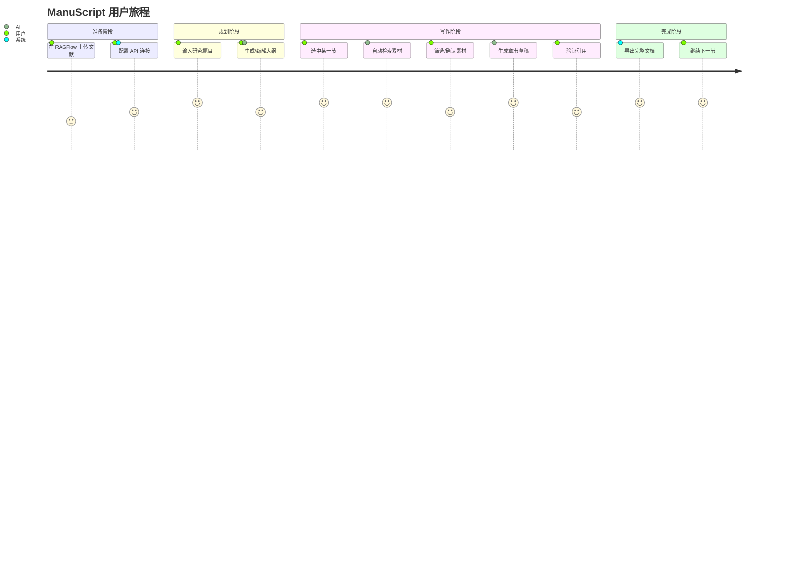

# ManuScript v2.0 架构选型与项目定位

> **文档版本**: 1.0
> **创建日期**: 2026-01-17
> **核心定位**: 基于代理编排的分节式素材组装系统 (Section-Driven Material Assembly System with Agent-Based Orchestration)

---

## 目录

1. [执行摘要](#1-执行摘要)
2. [项目定位](#2-项目定位)
3. [架构选型分析](#3-架构选型分析)
4. [用户需求分析](#4-用户需求分析)
5. [技术架构设计](#5-技术架构设计)
6. [与行业标杆的对比分析](#6-与行业标杆的对比分析)
7. [实施路线图](#7-实施路线图)

---

## 1. 执行摘要

### 1.1 核心结论

ManuScript v2.0 采用 **Material Assembly Agent System（素材组装代理系统）** 架构，这是一种针对学术写作场景优化的 Research Agent 变体。

**关键差异化**：
- **不是**"削弱版的 Deep Research"
- **而是**"专为学术写作优化的封闭域素材组装系统"

### 1.2 一句话定位

> ManuScript 是一个 **基于 RAGFlow 的学术写作流水线工具**，通过"大纲分节 → 精准素材召回 → 证据组装 → 草稿生成"的标准流程，帮助研究人员"拼装"出有据可依的论文初稿。

### 1.3 核心隐喻

| 角色 | 描述 |
|------|------|
| **配菜师** | 从 50 篇论文里把"这一节"需要的原料切好（Chunks） |
| **装配工** | 把原料按逻辑拼成一段话，并贴上原产地标签（Citation） |

---

## 2. 项目定位

### 2.1 定位矩阵

```
                    开放域（互联网）
                         ↑
                         │
    OpenAI Deep Research │  Anthropic Research System
         (通用报告)      │      (多智能体探索)
                         │
   ←────────────────────────────────────────────→
   单点检索                                   深度综合
                         │
                         │  ★ ManuScript v2.0
        SciSpace         │    (封闭域素材组装)
      (文献阅读)         │
                         │
                         ↓
                    封闭域（用户文献库）
```

### 2.2 战略定位声明

| 维度 | ManuScript v2.0 定位 |
|------|---------------------|
| **产品类型** | 垂直领域专业写作工具（非通用 AI 助手） |
| **核心能力** | 封闭域素材检索 + 证据组装 + 引用追溯 |
| **目标场景** | 从 Outline 到 First Draft 的"最后一公里" |
| **技术范式** | RAG + Agent Orchestration（代理编排） |
| **信息边界** | 仅限用户已上传/审核的文献库（Walled Garden） |

### 2.3 我们是什么 vs 我们不是什么

| ✅ 我们是 | ❌ 我们不是 |
|----------|------------|
| 证据组装系统 | 通用聊天机器人 |
| 学术写作流水线 | PDF 解析引擎 |
| RAGFlow 的高级客户端 | 独立的 RAG 系统 |
| 分节式草稿生成器 | 全篇一键生成器 |
| 认知脚手架 | 代笔工具 |

---

## 3. 架构选型分析

### 3.1 架构选型决策树

```
                    ┌─────────────────────────────┐
                    │   需要处理什么类型的信息？   │
                    └──────────────┬──────────────┘
                                   │
              ┌────────────────────┼────────────────────┐
              ↓                    ↓                    ↓
        开放网络信息          混合信息源           封闭文献库
              │                    │                    │
              ↓                    ↓                    ↓
      Deep Research          Hybrid Agent         Material Assembly
      (全自动探索)           (按需补充)            (精准组装)
              │                    │                    │
              ↓                    ↓                    ↓
        高幻觉风险            中等风险              极低风险
        高成本                中等成本              低成本
        低可控性              中等可控              高可控
                                                       ↓
                                              ★ ManuScript 选择
```

### 3.2 三种架构模式对比

| 维度 | Deep Research<br>(OpenAI/Anthropic) | Hybrid Agent<br>(混合模式) | Material Assembly<br>(ManuScript) |
|------|-------------------------------------|---------------------------|-----------------------------------|
| **信息源** | 开放互联网 | 本地库 + 网络补充 | 封闭用户文献库 |
| **探索模式** | 自主探索（Agentic） | 按需触发 | 定向检索 |
| **幻觉风险** | 高（~30-70%） | 中（~10-20%） | 极低（<5%） |
| **用户控制** | 低（黑盒） | 中 | 高（全程可见） |
| **响应延迟** | 分钟级 | 秒-分钟级 | 秒级 |
| **Token 成本** | 极高（15x chat） | 高（8x chat） | 中等（4x chat） |
| **适用场景** | 探索性调研 | 综合报告 | 学术写作 |

### 3.3 为什么选择 Material Assembly

#### 3.3.1 学术写作的特殊需求

```
学术写作 ≠ 信息综合

学术写作 = 证据组装 + 逻辑构建 + 精确引用
           ↓            ↓           ↓
        来源可控     结构先行     可追溯
```

#### 3.3.2 核心优势矩阵

| 需求 | Deep Research 方案 | Material Assembly 方案 | 胜出 |
|------|-------------------|----------------------|------|
| **引用准确性** | 网络信源质量不可控 | 用户预审文献，100% 可溯源 | ✅ MA |
| **幻觉控制** | 开放域增加幻觉风险 | 封闭域 Grounding，幻觉率 <5% | ✅ MA |
| **结构一致性** | 端到端生成，易"迷失中间" | 大纲驱动，分节生成 | ✅ MA |
| **响应速度** | 分钟级延迟 | 秒级响应，实时交互 | ✅ MA |
| **成本效率** | 高 Token 消耗 | 可控成本 | ✅ MA |
| **信息发现** | 能发现未知信源 | 依赖用户已有文献 | ✅ DR |

### 3.4 借鉴 Research Agent 的核心思想

虽然选择 Material Assembly 架构，但 ManuScript 借鉴了 Anthropic Research System 的关键设计原则：

| Anthropic 原则 | ManuScript 应用 |
|---------------|----------------|
| **Orchestrator-Worker 模式** | Lead Agent（Section Planner）+ Subagents（Retrieval/Assembly/Verify） |
| **并行化处理** | 多 Section 可并行检索和组装 |
| **专业化分工** | Query Generator / Chunk Ranker / Draft Writer / Verifier |
| **动态规划** | 根据 Section 意图生成检索策略 |
| **迭代优化** | 检索不足时可触发补充检索 |

---

## 4. 用户需求分析

### 4.1 目标用户画像

```
┌────────────────────────────────────────────────────────┐
│                    核心用户群                          │
├────────────────────────────────────────────────────────┤
│  👨‍🎓 硕博研究生                                        │
│     - 写毕业论文/期刊论文                              │
│     - 已有 20-100 篇相关文献                           │
│     - 痛点：文献太多，组织不起来                        │
│                                                        │
│  👩‍🏫 青年教师/博士后                                   │
│     - 写综述/项目申请书                                │
│     - 需要快速综合领域进展                             │
│     - 痛点：时间紧，引用必须精准                        │
│                                                        │
│  🔬 研究员                                             │
│     - 写研究报告/白皮书                                │
│     - 基于内部资料库写作                               │
│     - 痛点：资料分散，难以系统整理                      │
└────────────────────────────────────────────────────────┘
```

### 4.2 核心痛点机制分析

#### 痛点 1：认知过载 (Cognitive Overload)

```
传统流程：
  读论文A → 记笔记 → 读论文B → 记笔记 → ... → 读论文N
                         ↓
              脑子里一团浆糊，前面读的忘了
                         ↓
                    写不出来
```

**ManuScript 解法**：
- **Section Context Window**：只展示与当前章节相关的 5-10 个片段
- **降维打击**：把 50 篇论文的复杂度降维到"这一节需要的素材"

#### 痛点 2：引用焦虑 (Citation Anxiety)

```
用户心理：
  "这句话是我自己想的还是某篇论文说的？"
  "引用格式对不对？页码记错了怎么办？"
  "AI 生成的内容会不会编造引用？"
                         ↓
                    不敢下笔
```

**ManuScript 解法**：
- **Evidence Traceability**：每句话都带 `[Doc_ID:Page]` 坐标
- **点击即验证**：鼠标悬停显示原文片段
- **封闭域保证**：不可能引用不存在的文献

#### 痛点 3：结构性卡顿 (Structural Block)

```
传统流程：
  打开空白文档 → 盯着光标发呆 → 不知道第一句写啥
                         ↓
                      拖延症
```

**ManuScript 解法**：
- **Draft as Verification**：用户不需要"创作"，只需要"确认"
- **素材先行**：先看素材，再生成草稿，用户只做"编辑"

### 4.3 用户需求优先级矩阵

```
                    高频使用
                       ↑
                       │
   ┌───────────────────┼───────────────────┐
   │                   │                   │
   │  P0: 必须有       │  P1: 应该有       │
   │  • 分节素材检索   │  • 多格式导出     │
   │  • 引用追溯       │  • 批注协作       │
   │  • 草稿生成       │  • 版本历史       │
   │                   │                   │
 低价值 ───────────────┼─────────────────→ 高价值
   │                   │                   │
   │  P3: 暂不做       │  P2: 可以有       │
   │  • 通用聊天       │  • 图表智能描述   │
   │  • PDF 解析       │  • 缺口分析       │
   │  • 全文一键生成   │  • Deep Research  │
   │                   │                   │
   └───────────────────┼───────────────────┘
                       │
                       ↓
                    低频使用
```

### 4.4 用户旅程地图



---

## 5. 技术架构设计

### 5.1 系统架构总览

```
┌─────────────────────────────────────────────────────────────────┐
│                        ManuScript v2.0                          │
├─────────────────────────────────────────────────────────────────┤
│                                                                 │
│  ┌──────────────┐    ┌──────────────┐    ┌──────────────┐      │
│  │   Frontend   │    │    Agent     │    │   RAGFlow    │      │
│  │   (Gradio)   │◄──►│  Orchestrator│◄──►│     API      │      │
│  └──────────────┘    └──────┬───────┘    └──────────────┘      │
│                             │                                   │
│         ┌───────────────────┼───────────────────┐              │
│         ▼                   ▼                   ▼              │
│  ┌─────────────┐    ┌─────────────┐    ┌─────────────┐        │
│  │   Planner   │    │  Retrieval  │    │  Assembler  │        │
│  │    Agent    │    │    Agent    │    │    Agent    │        │
│  └─────────────┘    └─────────────┘    └─────────────┘        │
│         │                   │                   │              │
│         └───────────────────┼───────────────────┘              │
│                             ▼                                   │
│                      ┌─────────────┐                           │
│                      │   Verifier  │                           │
│                      │    Agent    │                           │
│                      └─────────────┘                           │
│                                                                 │
└─────────────────────────────────────────────────────────────────┘
```

### 5.2 代理链架构 (Chain-of-Agents)

```
用户选中 Section
       │
       ▼
┌─────────────────────────────────────────────────────────────┐
│                     Section Planner Agent                    │
│  • 分析 Section 标题 + 父级上下文                           │
│  • 确定写作意图（综述/方法/结果/讨论）                       │
│  • 生成检索策略                                             │
└───────────────────────────┬─────────────────────────────────┘
                            │
                            ▼
┌─────────────────────────────────────────────────────────────┐
│                    Query Generator Agent                     │
│  • 生成 3-5 个检索关键词                                    │
│  • 考虑同义词和相关概念                                      │
│  • 输出结构化 Query                                          │
└───────────────────────────┬─────────────────────────────────┘
                            │
                            ▼
┌─────────────────────────────────────────────────────────────┐
│                     Retrieval Agent                          │
│  • 调用 RAGFlow /retrieval API                              │
│  • 执行向量检索 + 关键词检索                                 │
│  • 返回 Top-K Chunks                                        │
└───────────────────────────┬─────────────────────────────────┘
                            │
                            ▼
┌─────────────────────────────────────────────────────────────┐
│                    Chunk Ranker Agent                        │
│  • 相关性重排序                                             │
│  • 剔除噪音（如参考文献列表）                                │
│  • 多样性筛选（避免同一论文过多）                            │
└───────────────────────────┬─────────────────────────────────┘
                            │
                            ▼
┌─────────────────────────────────────────────────────────────┐
│                    Draft Writer Agent                        │
│  • 基于筛选后的 Chunks 撰写段落                             │
│  • 强制内联引用 [Doc_ID:Page]                               │
│  • 保持学术写作风格                                          │
└───────────────────────────┬─────────────────────────────────┘
                            │
                            ▼
┌─────────────────────────────────────────────────────────────┐
│                     Verifier Agent                           │
│  • 检查每句话是否有对应原文支撑                              │
│  • 标记潜在幻觉                                              │
│  • 验证引用格式正确性                                        │
└───────────────────────────┬─────────────────────────────────┘
                            │
                            ▼
                      输出验证后的草稿
```

### 5.3 数据流架构

```
┌─────────────────────────────────────────────────────────────────┐
│                        数据流向                                  │
├─────────────────────────────────────────────────────────────────┤
│                                                                 │
│   [RAGFlow Cloud]                                               │
│        │                                                        │
│        │ ← API Key + Dataset ID                                 │
│        ▼                                                        │
│   ┌─────────────┐                                               │
│   │  文献元数据  │ ← Title, Author, Doc_ID (不下载全文)         │
│   └──────┬──────┘                                               │
│          │                                                      │
│          ▼                                                      │
│   ┌─────────────┐    ┌─────────────┐    ┌─────────────┐        │
│   │   Project   │───►│   Outline   │───►│   Section   │        │
│   │    JSON     │    │    Tree     │    │   Context   │        │
│   └─────────────┘    └─────────────┘    └──────┬──────┘        │
│                                                │                │
│                                                ▼                │
│                                        /retrieval API          │
│                                                │                │
│                                                ▼                │
│   ┌─────────────┐    ┌─────────────┐    ┌─────────────┐        │
│   │   Chunks    │───►│   Ranked    │───►│    Draft    │        │
│   │   Raw       │    │   Chunks    │    │   + Cite    │        │
│   └─────────────┘    └─────────────┘    └─────────────┘        │
│                                                                 │
└─────────────────────────────────────────────────────────────────┘
```

### 5.4 技术栈选型

| 层级 | 技术选择 | 选型理由 |
|------|---------|---------|
| **Frontend** | Gradio (MVP) → React (V2) | 快速原型 → 生产级体验 |
| **Backend** | Python + FastAPI | 轻量、异步、LLM 生态完善 |
| **RAG Engine** | RAGFlow API (必须) | 托管解析、向量化，减少工程量 60% |
| **LLM** | OpenAI Compatible API | 灵活切换模型 |
| **Agent Framework** | LangGraph / 自建 | 支持复杂工作流编排 |
| **Storage** | SQLite / PostgreSQL | Project → Outline → Draft 轻量结构 |

### 5.5 并行化设计

借鉴 Anthropic 的并行化策略：

```
当前（串行）：
Section A → 检索 → 组装 → Draft A
Section B → 检索 → 组装 → Draft B  (等待 A 完成)
Section C → 检索 → 组装 → Draft C  (等待 B 完成)

优化后（并行）：
Section A ┐
Section B ├─→ 并行检索 → 并行组装 → 汇总
Section C ┘

预期收益：复杂文档处理时间减少 60-70%
```

---

## 6. 与行业标杆的对比分析

### 6.0 三方对比总览

| 项目类型 | ManuScript v2.0 | Anthropic Research | OpenAI Deep Research |
|---|---|---|---|
| **本质** | 素材组装代理系统 | 多智能体研究系统 | 自主网络代理 |
| **信息源** | 封闭 PDF 库 | 开放网络 | 开放网络 |
| **代理架构** | ✅ 有（简化版 Chain-of-Agents） | ✅ 有（完整版 Orchestrator-Worker） | ✅ 有（浏览器代理） |
| **并行化** | ⚠️ 架构支持，待优化 | ✅ 核心优势（3-5 subagents 并行） | ✅ 有 |
| **幻觉风险** | 极低（封闭域 + Verifier） | 中（依赖模型能力） | 高（开放网络信源） |
| **用户控制权** | 高（全程可见可干预） | 中（可查看搜索轨迹） | 低（黑盒处理） |
| **响应延迟** | 秒级 | 分钟级 | 分钟级 |
| **Token 消耗** | ~4x chat | ~15x chat | 极高 |
| **适用场景** | 学术写作（基于已有文献） | 探索性研究（发现未知） | 通用信息综合 |

> **核心洞察**：ManuScript 不是"削弱版的 Deep Research"，而是"专为学术写作优化的封闭域素材组装系统"。

---

### 6.1 与 Anthropic Research System 的对比

| 维度 | Anthropic Research System | ManuScript v2.0 |
|------|--------------------------|-----------------|
| **多智能体模式** | ✅ 完整（Orchestrator-Worker） | ✅ 简化版（Chain-of-Agents） |
| **Lead Agent** | 规划 + 协调 + 动态创建子代理 | Section Planner（静态流程） |
| **Subagents** | 并行网络搜索，数量动态 | 封闭域专业子代理，数量固定 |
| **信息源** | 开放网络 + Google Workspace | 封闭知识库（用户 PDF） |
| **搜索策略** | 广度优先 + 多轮迭代 | 定向检索（基于 Section 意图） |
| **幻觉控制** | 依赖模型能力 | Verifier Agent + 封闭域 |
| **Token 消耗** | ~15x chat | ~4x chat |
| **适用场景** | 探索性研究 | 学术写作 |

### 6.2 与 OpenAI Deep Research 的对比

| 维度 | OpenAI Deep Research | ManuScript v2.0 |
|------|---------------------|-----------------|
| **核心能力** | 自主 Web 代理 | 封闭域素材组装 |
| **用户控制权** | 低（黑盒） | 高（全程可见可干预） |
| **引用可靠性** | 波动（取决于网络信源） | 极高（用户预审文献） |
| **响应延迟** | 分钟级 | 秒级 |
| **成本** | $200/月订阅 | 可控（按实际使用） |
| **隐私保护** | 数据上传云端 | 支持本地/私有云 |

### 6.3 ManuScript 的独特价值主张

```
┌─────────────────────────────────────────────────────────────────┐
│              ManuScript v2.0 独特价值主张                        │
├─────────────────────────────────────────────────────────────────┤
│                                                                 │
│   "ManuScript v2.0 的成功关键不在于拥有最强的模型，              │
│    而在于拥有最懂学术工作流的上下文环境。"                       │
│                                                                 │
│   ┌───────────────┐   ┌───────────────┐   ┌───────────────┐    │
│   │   Deep        │   │   Material    │   │   Human-in-   │    │
│   │   Context     │ + │   Assembly    │ + │   the-Loop    │    │
│   │   (学术理解)  │   │   (证据组装)  │   │   (用户掌控)  │    │
│   └───────────────┘   └───────────────┘   └───────────────┘    │
│            │                  │                  │              │
│            └──────────────────┼──────────────────┘              │
│                               ▼                                 │
│                    ┌─────────────────────┐                     │
│                    │  可信赖的学术写作    │                     │
│                    │      认知脚手架      │                     │
│                    └─────────────────────┘                     │
│                                                                 │
└─────────────────────────────────────────────────────────────────┘
```

---

## 7. 实施路线图

### 7.1 Phase 1: MVP "智能泥瓦匠" (Q1-Q2)

**目标**: 打通核心流程，验证价值假设

| 功能模块 | 具体内容 | 优先级 |
|---------|---------|--------|
| KB 接入 | RAGFlow API 对接、文献列表同步 | P0 |
| 大纲引擎 | 大纲生成/编辑、树状结构管理 | P0 |
| 素材配菜 | Query 生成、检索、重排序 | P0 |
| 草稿组装 | Draft 生成、强制引用标记 | P0 |
| 证据溯源 | 点击引用查看原文 | P0 |

**验收标准**:
- 引用准确率 ≥ 99%
- 1000 字章节生成延迟 ≤ 30 秒
- 用户满意度 NPS ≥ 40

### 7.2 Phase 2: "缺口侦探" (Q3)

**目标**: 引入受控的 Deep Research 作为补充

```
场景触发：
Material Assembly 检测到素材不足
        │
        ▼
   ┌─────────────────────────────────────────┐
   │  "现有文献缺乏关于 X 的数据，           │
   │   是否启动 Deep Research 补充？"         │
   │                                         │
   │   [是，搜索网络]    [否，继续使用现有]   │
   └─────────────────────────────────────────┘
```

**关键设计**:
- On-Demand 触发，非默认开启
- 搜索结果需用户确认才纳入素材库
- 明确标记"网络来源"vs"本地文献"

### 7.3 Phase 3: 生态整合 (Q4+)

**目标**: 构建垂直工作流生态

| 整合方向 | 具体内容 |
|---------|---------|
| **文献管理** | Zotero/Mendeley API 自动同步 |
| **排版输出** | Overleaf/Word 插件，一键导出 |
| **协作功能** | 多人批注、版本对比 |
| **高级分析** | GraphRAG 知识图谱、跨文档推理 |

---

## 附录 A: 关键术语表

| 术语 | 定义 |
|------|------|
| **Material Assembly** | 基于用户预审素材库的智能组装模式 |
| **Deep Research** | 基于 Web 代理的自主信息综合模式 |
| **RAG** | Retrieval-Augmented Generation，检索增强生成 |
| **GraphRAG** | 基于知识图谱的 RAG 升级版本 |
| **Chain-of-Agents** | 多个专业代理串联协作的工作流模式 |
| **HITL** | Human-in-the-Loop，人在回路 |
| **Grounding** | 将 LLM 输出锚定在可信来源上，降低幻觉 |

---

## 附录 B: 决策记录

| 决策项 | 选择 | 理由 |
|--------|------|------|
| 核心架构 | Material Assembly | 学术场景需要高可信度、低幻觉 |
| RAG 引擎 | RAGFlow 托管 | 减少工程量 60%，专注业务逻辑 |
| 代理框架 | Chain-of-Agents | 流程可控，易于调试 |
| Deep Research | Phase 2 插件 | 作为补充而非核心，按需触发 |
| 并行化 | Phase 1 预留 | 架构支持，优化时机待定 |

---

> **文档维护**: 本文档应随项目演进持续更新
>
> **最后更新**: 2026-01-17
