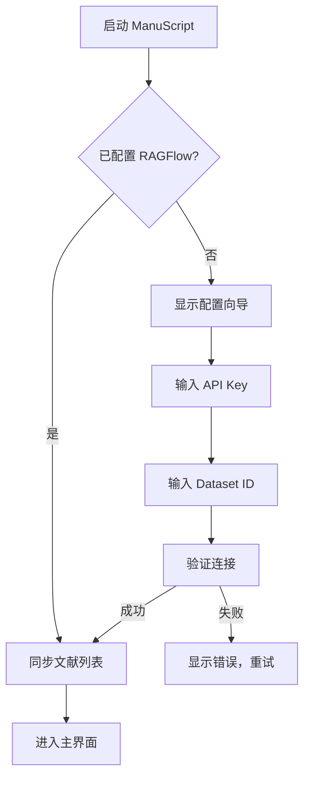
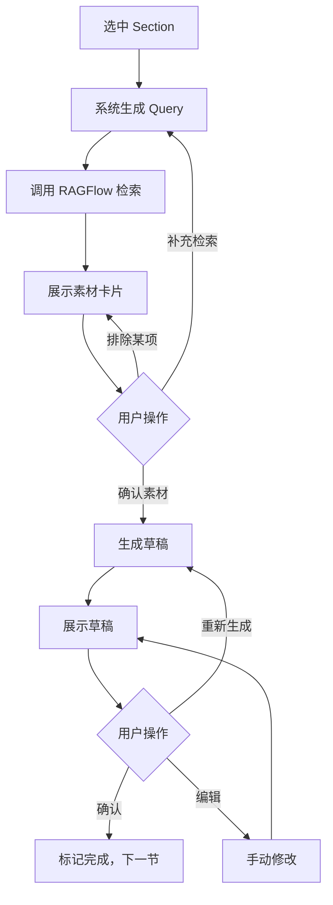

# ManuScript v2.0 产品需求文档 (PRD)

> **文档版本**: 2.0
> **创建日期**: 2026-01-17
> **文档状态**: Draft → Review → **Approved**
> **产品负责人**: [待填写]
> **技术负责人**: [待填写]

---

## 文档修订历史

| 版本 | 日期 | 修订内容 | 作者 |
|------|------|---------|------|
| 1.0 | - | 初始版本 | - |
| 2.0 | 2026-01-17 | 架构重构：移除本地 RAG，采用 RAGFlow 托管 + Agent 编排 | - |

---

## 目录

1. [执行摘要](#1-执行摘要)
2. [产品愿景与定位](#2-产品愿景与定位)
3. [目标用户与需求分析](#3-目标用户与需求分析)
4. [产品范围界定](#4-产品范围界定)
5. [功能需求规格](#5-功能需求规格)
6. [用户界面与交互设计](#6-用户界面与交互设计)
7. [技术架构与实现](#7-技术架构与实现)
8. [数据模型设计](#8-数据模型设计)
9. [API 接口规范](#9-api-接口规范)
10. [非功能性需求](#10-非功能性需求)
11. [验收标准与测试计划](#11-验收标准与测试计划)
12. [风险评估与缓解](#12-风险评估与缓解)
13. [实施路线图](#13-实施路线图)
14. [附录](#14-附录)

---

## 1. 执行摘要

### 1.1 项目背景

学术写作领域面临 AI 工具的结构性变革。现有工具（如 Jenni AI、SciSpace）要么专注文本润色，要么专注文献检索，缺乏将"阅读-整理-写作"整合的完整解决方案。

### 1.2 产品定义

**一句话定位**：
> ManuScript 是一个 **基于 RAGFlow 的学术写作流水线工具**，通过"大纲分节 → 精准素材召回 → 证据组装 → 草稿生成"的标准流程，帮助研究人员"拼装"出有据可依的论文初稿。

### 1.3 核心价值主张

| 价值维度 | 具体表现 |
|---------|---------|
| **降低认知负荷** | 每次只处理一个 Section 的素材，而非 50 篇论文 |
| **消除引用焦虑** | 每句话都有可追溯的 `[Doc_ID:Page]` 坐标 |
| **打破写作阻塞** | 用户确认素材而非创作，Draft as Verification |

### 1.4 v2.0 核心变更

| 变更项 | v1.x | v2.0 |
|--------|------|------|
| RAG 引擎 | 本地 PDF 解析 + 向量库 | RAGFlow API 托管 |
| 架构模式 | 单体应用 | Agent 编排（Chain-of-Agents） |
| 产品定位 | 辅助研究 | 证据组装与写作 |
| 工程复杂度 | 高（全链路自建） | 低（专注业务逻辑） |

---

## 2. 产品愿景与定位

### 2.1 产品愿景

> **"让每一位研究者都能写出有据可依的论文初稿"**

### 2.2 战略定位

```
┌─────────────────────────────────────────────────────────────┐
│                    市场定位矩阵                              │
├─────────────────────────────────────────────────────────────┤
│                                                             │
│                    开放域（互联网）                          │
│                         ↑                                   │
│                         │                                   │
│    OpenAI Deep Research │  Anthropic Research              │
│         (通用报告)      │      (多智能体探索)               │
│                         │                                   │
│   ←─────────────────────┼───────────────────────────────→  │
│   单点检索              │                        深度综合   │
│                         │                                   │
│                         │  ★ ManuScript v2.0               │
│        SciSpace         │    (封闭域素材组装)               │
│      (文献阅读)         │                                   │
│                         │                                   │
│                         ↓                                   │
│                    封闭域（用户文献库）                       │
│                                                             │
└─────────────────────────────────────────────────────────────┘
```

### 2.3 核心隐喻

ManuScript 不是"聊天机器人"，而是 **"配菜师 + 装配工"**：

| 角色 | 职责 | 对应功能 |
|------|------|---------|
| **配菜师** | 从 50 篇论文里把"这一节"需要的原料切好 | Material Assembly |
| **装配工** | 把原料按逻辑拼成一段话，贴上原产地标签 | Draft Writer + Citation |

### 2.4 我们是什么 vs 我们不是什么

| ✅ 我们是 | ❌ 我们不是 |
|----------|------------|
| 证据组装系统 | 通用聊天机器人 |
| 学术写作流水线 | PDF 解析引擎 |
| RAGFlow 的高级客户端 | 独立的 RAG 系统 |
| 分节式草稿生成器 | 全篇一键生成器 |
| 认知脚手架 | 代笔工具 |

---

## 3. 目标用户与需求分析

### 3.1 目标用户画像

#### 3.1.1 主要用户群 (Primary Persona)

```
┌────────────────────────────────────────────────────────────┐
│  👨‍🎓 Persona A: 硕博研究生 "小王"                          │
├────────────────────────────────────────────────────────────┤
│  年龄：25-30 岁                                             │
│  场景：撰写毕业论文/期刊论文                                │
│  文献量：已有 20-100 篇相关文献                             │
│  痛点：                                                    │
│    • 文献太多，读了后面忘前面                               │
│    • 不知道如何组织成连贯的论述                             │
│    • 担心引用出错被导师批评                                 │
│  期望：                                                    │
│    • 帮我整理文献，告诉我每一节该引用哪些                    │
│    • 生成的内容必须有出处可查                               │
└────────────────────────────────────────────────────────────┘
```

```
┌────────────────────────────────────────────────────────────┐
│  👩‍🏫 Persona B: 青年教师/博士后 "李老师"                    │
├────────────────────────────────────────────────────────────┤
│  年龄：30-40 岁                                             │
│  场景：撰写综述论文/项目申请书                              │
│  文献量：领域积累 100+ 篇                                   │
│  痛点：                                                    │
│    • 时间紧张，需要快速综合领域进展                         │
│    • 引用必须精准，不能有任何差错                           │
│    • 需要覆盖全面但不能遗漏关键文献                         │
│  期望：                                                    │
│    • 基于我的文献库快速生成综述框架                         │
│    • 确保重要观点都有对应引用                               │
└────────────────────────────────────────────────────────────┘
```

```
┌────────────────────────────────────────────────────────────┐
│  🔬 Persona C: 企业研究员 "张工"                            │
├────────────────────────────────────────────────────────────┤
│  年龄：28-45 岁                                             │
│  场景：撰写技术报告/白皮书                                  │
│  文献量：内部资料 + 外部论文混合                            │
│  痛点：                                                    │
│    • 资料分散在多个系统中                                   │
│    • 需要快速整合形成结构化报告                             │
│    • 内部资料保密性要求高                                   │
│  期望：                                                    │
│    • 支持私有部署或本地处理                                 │
│    • 快速从资料库中提取关键信息                             │
└────────────────────────────────────────────────────────────┘
```

### 3.2 核心痛点分析

#### 痛点 1：认知过载 (Cognitive Overload)

```
问题机制：
┌─────────────────────────────────────────────────────────────┐
│  读论文A → 记笔记 → 读论文B → 记笔记 → ... → 读论文N        │
│                              ↓                              │
│               工作记忆超载，前面读的内容已经模糊              │
│                              ↓                              │
│                   面对空白文档，无从下笔                     │
└─────────────────────────────────────────────────────────────┘

ManuScript 解法：Section Context Window
┌─────────────────────────────────────────────────────────────┐
│  用户选中 "3.1 Method" → 系统只展示 5-10 个相关片段         │
│                              ↓                              │
│               50 篇论文的复杂度 → 降维到 10 个卡片           │
│                              ↓                              │
│                   认知负荷从 O(n) 降到 O(1)                  │
└─────────────────────────────────────────────────────────────┘
```

#### 痛点 2：引用焦虑 (Citation Anxiety)

```
问题机制：
┌─────────────────────────────────────────────────────────────┐
│  "这句话是我自己想的还是某篇论文说的？"                      │
│  "AI 生成的内容会不会编造引用？"                            │
│  "引用格式对不对？页码记错了怎么办？"                        │
│                              ↓                              │
│                         不敢下笔                            │
└─────────────────────────────────────────────────────────────┘

ManuScript 解法：Evidence Traceability
┌─────────────────────────────────────────────────────────────┐
│  • 每句话强制带 [Doc_ID:Page] 坐标                          │
│  • 点击引用标记 → 弹窗显示原文片段                          │
│  • 封闭域保证：不可能引用不存在的文献                        │
│                              ↓                              │
│                   引用准确率 ≥ 99%                          │
└─────────────────────────────────────────────────────────────┘
```

#### 痛点 3：结构性卡顿 (Structural Block)

```
问题机制：
┌─────────────────────────────────────────────────────────────┐
│  打开 Word → 空白文档 → 光标闪烁 → 不知道第一句写啥         │
│                              ↓                              │
│                           拖延症                            │
└─────────────────────────────────────────────────────────────┘

ManuScript 解法：Draft as Verification
┌─────────────────────────────────────────────────────────────┐
│  系统先展示素材卡片 → 用户确认/筛选 → 系统生成草稿          │
│                              ↓                              │
│           用户角色从"创作者"转变为"审核者"                  │
│                              ↓                              │
│                   消除"空白画布恐惧"                        │
└─────────────────────────────────────────────────────────────┘
```

### 3.3 用户需求优先级

| 优先级 | 需求类别 | 具体需求 | 用户价值 |
|--------|---------|---------|---------|
| **P0** | 核心功能 | 分节素材检索 | 解决认知过载 |
| **P0** | 核心功能 | 引用追溯 | 解决引用焦虑 |
| **P0** | 核心功能 | 草稿生成 | 解决结构卡顿 |
| **P1** | 增强功能 | 多格式导出 (Word/LaTeX) | 对接下游工作流 |
| **P1** | 增强功能 | 大纲智能生成 | 加速启动 |
| **P2** | 扩展功能 | 图表智能描述 | 丰富内容 |
| **P2** | 扩展功能 | 缺口分析 (Gap Analysis) | 发现素材不足 |
| **P3** | 未来功能 | Deep Research 补充 | 填补知识盲区 |

---

## 4. 产品范围界定

### 4.1 功能范围 (In Scope)

| 模块 | 功能 | MVP | V2 | V3 |
|------|------|:---:|:--:|:--:|
| **知识库接入** | RAGFlow API 连接 | ✅ | ✅ | ✅ |
| | 文献列表同步 | ✅ | ✅ | ✅ |
| | 文献状态检查 | ✅ | ✅ | ✅ |
| **大纲引擎** | 大纲生成 | ✅ | ✅ | ✅ |
| | 大纲编辑 (增删改拖拽) | ✅ | ✅ | ✅ |
| | 大纲模板 | - | ✅ | ✅ |
| **素材配菜** | Query 智能生成 | ✅ | ✅ | ✅ |
| | RAGFlow 检索 | ✅ | ✅ | ✅ |
| | Chunk 重排序 | ✅ | ✅ | ✅ |
| | 素材卡片展示 | ✅ | ✅ | ✅ |
| **草稿组装** | 段落生成 | ✅ | ✅ | ✅ |
| | 强制引用标记 | ✅ | ✅ | ✅ |
| | 图表描述 | - | ✅ | ✅ |
| **证据溯源** | 引用点击查看 | ✅ | ✅ | ✅ |
| | 原文高亮定位 | - | ✅ | ✅ |
| **导出** | Markdown 导出 | ✅ | ✅ | ✅ |
| | Word 导出 | - | ✅ | ✅ |
| | LaTeX 导出 | - | - | ✅ |
| **高级功能** | 缺口分析 | - | ✅ | ✅ |
| | Deep Research 补充 | - | - | ✅ |
| | Zotero 同步 | - | - | ✅ |

### 4.2 明确不做 (Out of Scope)

| 不做项 | 原因 | 替代方案 |
|--------|------|---------|
| ❌ PDF 解析器 | 这是 RAGFlow 的职责 | 使用 RAGFlow API |
| ❌ 通用 Chat | 违背产品定位 | 所有对话挂载在 Section 下 |
| ❌ 全篇一键生成 | 易产生垃圾内容 | 分节渐进生成 |
| ❌ 上传 PDF | 我们只是 RAGFlow 客户端 | 引导用户在 RAGFlow 上传 |
| ❌ 向量库管理 | 增加工程复杂度 | 依赖 RAGFlow 托管 |

---

## 5. 功能需求规格

### 5.1 F1: 知识库接入层 (Knowledge Layer)

#### 5.1.1 功能描述

用户配置 RAGFlow 连接信息后，系统自动同步文献列表。

#### 5.1.2 用户故事

```
作为一名研究生，
我希望输入 RAGFlow 的 API Key 和 Dataset ID，
以便系统能够访问我在 RAGFlow 中已解析的论文库。
```

#### 5.1.3 功能规格

| 字段 | 规格 |
|------|------|
| **输入** | RAGFlow API Key, Dataset ID |
| **处理** | 调用 RAGFlow API 获取文献列表 |
| **输出** | 文献列表（Title, Author, Doc_ID, Status） |
| **约束** | 仅显示 `status = Parsed` 的文献 |

#### 5.1.4 接口调用

```python
# 伪代码
def sync_knowledge_base(api_key: str, dataset_id: str) -> List[Document]:
    """
    同步 RAGFlow 知识库文献列表
    """
    client = RAGFlowClient(api_key)
    documents = client.list_documents(dataset_id)
    return [doc for doc in documents if doc.status == "Parsed"]
```

#### 5.1.5 验收标准

- [ ] 用户输入有效 API Key 后，3 秒内显示文献列表
- [ ] 文献列表包含：标题、作者、文档 ID
- [ ] 无效 API Key 显示明确错误提示
- [ ] 仅显示已解析完成的文献

---

### 5.2 F2: 大纲引擎 (Outline Engine)

#### 5.2.1 功能描述

用户输入研究题目，系统生成标准论文大纲；用户可自由编辑大纲结构。

#### 5.2.2 用户故事

```
作为一名研究生，
我希望输入论文题目后系统自动生成大纲，
以便我有一个起点开始组织论文结构。
```

```
作为一名研究生，
我希望能够自由编辑大纲（增、删、改、拖拽），
以便大纲符合我的实际需求。
```

#### 5.2.3 功能规格

| 操作 | 描述 | 快捷键 |
|------|------|--------|
| **生成** | 基于题目/摘要生成标准大纲 | - |
| **新增** | 在当前节点下新增子节点 | `Ctrl+Enter` |
| **删除** | 删除当前节点及其子节点 | `Delete` |
| **编辑** | 双击编辑节点标题 | `F2` |
| **拖拽** | 拖动节点调整顺序/层级 | 鼠标拖拽 |
| **折叠** | 折叠/展开子节点 | `Space` |

#### 5.2.4 数据结构

```json
{
  "outline": {
    "id": "outline_001",
    "title": "基于深度学习的图像分类研究",
    "children": [
      {
        "id": "section_001",
        "title": "1. 引言",
        "level": 1,
        "status": "draft",
        "children": [
          {
            "id": "section_001_1",
            "title": "1.1 研究背景",
            "level": 2,
            "status": "pending"
          }
        ]
      }
    ]
  }
}
```

#### 5.2.5 验收标准

- [ ] 输入题目后 5 秒内生成标准大纲
- [ ] 大纲支持至少 4 级嵌套
- [ ] 所有编辑操作实时保存
- [ ] 大纲变更不影响已生成的草稿

---

### 5.3 F3: 自动化配菜系统 (Material Assembly)

#### 5.3.1 功能描述

用户选中某个 Section 后，系统自动检索相关素材并以卡片形式展示。

#### 5.3.2 用户故事

```
作为一名研究生，
我希望点击某个章节后系统自动找出相关文献片段，
以便我不用手动翻阅 50 篇论文。
```

#### 5.3.3 处理流程

```
┌─────────────────────────────────────────────────────────────┐
│                    Material Assembly 流程                    │
├─────────────────────────────────────────────────────────────┤
│                                                             │
│   用户选中 Section                                          │
│        │                                                    │
│        ▼                                                    │
│   ┌─────────────────────────────────────────────────────┐  │
│   │  Step 1: Query 生成                                  │  │
│   │  • 输入：Section 标题 + 父级标题 + 论文题目          │  │
│   │  • 输出：3-5 个检索关键词                            │  │
│   │  • 模型：GPT-4 / Claude                              │  │
│   └───────────────────────────┬─────────────────────────┘  │
│                               │                             │
│                               ▼                             │
│   ┌─────────────────────────────────────────────────────┐  │
│   │  Step 2: RAGFlow 检索                                │  │
│   │  • 调用 /retrieval API                               │  │
│   │  • 参数：keywords, top_k=20                          │  │
│   │  • 返回：Chunk 列表 (content, doc_id, page, score)   │  │
│   └───────────────────────────┬─────────────────────────┘  │
│                               │                             │
│                               ▼                             │
│   ┌─────────────────────────────────────────────────────┐  │
│   │  Step 3: 重排序 (Re-ranking)                         │  │
│   │  • LLM 评估每个 Chunk 的相关性                       │  │
│   │  • 剔除噪音（参考文献列表、页眉页脚等）              │  │
│   │  • 多样性筛选（避免同一论文过多）                    │  │
│   │  • 输出：Top-10 高质量 Chunks                        │  │
│   └───────────────────────────┬─────────────────────────┘  │
│                               │                             │
│                               ▼                             │
│   ┌─────────────────────────────────────────────────────┐  │
│   │  Step 4: 卡片展示                                    │  │
│   │  • 每个 Chunk 一张卡片                               │  │
│   │  • 显示：内容摘要 + 来源论文 + 页码                  │  │
│   │  • 操作：收藏 / 排除 / 查看原文                      │  │
│   └─────────────────────────────────────────────────────┘  │
│                                                             │
└─────────────────────────────────────────────────────────────┘
```

#### 5.3.4 素材卡片设计

```
┌─────────────────────────────────────────────────────────────┐
│  📄 深度学习在图像分类中的应用综述                          │
│  ─────────────────────────────────────────────────────────  │
│  "卷积神经网络（CNN）通过局部感受野和权重共享机制，          │
│   能够有效提取图像的层次化特征，在 ImageNet 竞赛中           │
│   取得了突破性进展..."                                      │
│  ─────────────────────────────────────────────────────────  │
│  📚 来源：Smith et al., 2023 | 📄 Page 12-13               │
│  ─────────────────────────────────────────────────────────  │
│  [⭐ 收藏]  [🚫 排除]  [👁 查看原文]                        │
└─────────────────────────────────────────────────────────────┘
```

#### 5.3.5 验收标准

- [ ] 选中 Section 后 5 秒内显示素材卡片
- [ ] 返回 5-10 个高相关性片段
- [ ] 每个片段都有明确的来源标识
- [ ] 噪音内容（参考文献列表等）被有效过滤

---

### 5.4 F4: 写作装配工 (Draft Assembler)

#### 5.4.1 功能描述

基于用户确认的素材，生成带引用标记的段落草稿。

#### 5.4.2 用户故事

```
作为一名研究生，
我希望系统基于筛选后的素材自动生成草稿，
以便我有一个可以编辑的起点。
```

```
作为一名研究生，
我希望生成的每一句话都标注引用来源，
以便我可以验证内容的准确性。
```

#### 5.4.3 Prompt 模板

```markdown
## System Prompt

你是一位专业的学术写作助手。你的任务是基于提供的文献片段，
撰写学术论文的某一章节。

**核心要求**：
1. 仅使用提供的 Context 中的信息
2. 每一个观点都必须标注引用，格式为 [Doc_ID:Page]
3. 不得编造任何未在 Context 中出现的信息
4. 保持学术写作的严谨风格

## User Prompt

**论文题目**：{paper_title}
**当前章节**：{section_title}
**上级章节**：{parent_section}
**写作意图**：{intent}  // 综述/方法描述/结果分析/讨论

**参考素材 (Context)**：
{chunks}

请基于以上素材，撰写关于"{section_title}"的学术段落。
```

#### 5.4.4 输出格式

```markdown
深度学习技术在图像分类领域取得了显著进展。卷积神经网络（CNN）
通过局部感受野和权重共享机制，能够有效提取图像的层次化特征
[doc_001:12]。自 2012 年 AlexNet 在 ImageNet 竞赛中取得突破以来，
CNN 架构不断演进，从 VGGNet 的深度堆叠 [doc_002:45] 到 ResNet
的残差连接 [doc_003:8]，模型性能持续提升。
```

#### 5.4.5 验收标准

- [ ] 生成内容中 ≥80% 的句子带有引用标记
- [ ] 所有引用标记都指向有效的文献
- [ ] 不出现 Context 中没有的事实性陈述
- [ ] 生成延迟 ≤15 秒/500 字

---

### 5.5 F5: 证据溯源层 (Trust Layer)

#### 5.5.1 功能描述

用户点击草稿中的引用标记，可查看原文片段。

#### 5.5.2 用户故事

```
作为一名研究生，
我希望点击引用标记后能看到原文，
以便我验证 AI 生成的内容是否准确。
```

#### 5.5.3 交互设计

```
┌─────────────────────────────────────────────────────────────┐
│                        草稿区域                              │
├─────────────────────────────────────────────────────────────┤
│                                                             │
│  深度学习技术在图像分类领域取得了显著进展。卷积神经网络     │
│  （CNN）通过局部感受野和权重共享机制，能够有效提取图像的    │
│  层次化特征 [doc_001:12]。                                  │
│              ↑                                              │
│              │ 用户点击                                     │
│              ▼                                              │
│  ┌─────────────────────────────────────────────────────┐   │
│  │  📖 原文片段                                         │   │
│  │  ─────────────────────────────────────────────────  │   │
│  │  来源：深度学习在图像分类中的应用综述                │   │
│  │  作者：Smith et al., 2023                           │   │
│  │  页码：12                                            │   │
│  │  ─────────────────────────────────────────────────  │   │
│  │  "Convolutional Neural Networks (CNNs) utilize      │   │
│  │   local receptive fields and weight sharing to      │   │
│  │   effectively extract hierarchical features from    │   │
│  │   images, achieving breakthrough performance..."     │   │
│  │  ─────────────────────────────────────────────────  │   │
│  │  [在 RAGFlow 中查看完整文档]                         │   │
│  └─────────────────────────────────────────────────────┘   │
│                                                             │
└─────────────────────────────────────────────────────────────┘
```

#### 5.5.4 验收标准

- [ ] 点击引用标记后 1 秒内显示原文弹窗
- [ ] 原文片段与草稿中引用的内容语义一致
- [ ] 提供跳转到 RAGFlow 查看完整文档的链接

---

## 6. 用户界面与交互设计

### 6.1 整体布局

```
┌─────────────────────────────────────────────────────────────────────────┐
│  [ManuScript]                                    [设置] [导出] [帮助]   │
├─────────────────────────────────────────────────────────────────────────┤
│                                                                         │
│  ┌───────────────┐  ┌─────────────────────┐  ┌───────────────────────┐ │
│  │               │  │                     │  │                       │ │
│  │   📑 大纲区    │  │    📦 素材区        │  │     ✍️ 写作区         │ │
│  │               │  │                     │  │                       │ │
│  │  1. 引言      │  │  ┌───────────────┐ │  │  深度学习技术在图像   │ │
│  │    1.1 背景 ◄─┼──┼──┤ 素材卡片 1   │ │  │  分类领域取得了...    │ │
│  │    1.2 目的   │  │  └───────────────┘ │  │  [doc_001:12]         │ │
│  │  2. 文献综述  │  │  ┌───────────────┐ │  │                       │ │
│  │    2.1 CNN    │  │  │ 素材卡片 2   │ │  │  自 2012 年 AlexNet   │ │
│  │    2.2 Trans  │  │  └───────────────┘ │  │  在 ImageNet 竞赛...  │ │
│  │  3. 方法      │  │  ┌───────────────┐ │  │  [doc_002:45]         │ │
│  │  4. 实验      │  │  │ 素材卡片 3   │ │  │                       │ │
│  │  5. 结论      │  │  └───────────────┘ │  │                       │ │
│  │               │  │                     │  │                       │ │
│  │               │  │  [+ 补充检索]       │  │  [重新生成] [确认]    │ │
│  └───────────────┘  └─────────────────────┘  └───────────────────────┘ │
│                                                                         │
├─────────────────────────────────────────────────────────────────────────┤
│  状态栏：已连接 RAGFlow | 文献：23 篇 | 当前章节：1.1 研究背景         │
└─────────────────────────────────────────────────────────────────────────┘
```

### 6.2 三栏布局说明

| 区域 | 宽度 | 功能 |
|------|------|------|
| **大纲区 (左)** | 20% | 树状大纲导航，显示进度状态 |
| **素材区 (中)** | 35% | 展示检索到的 Chunks，支持筛选 |
| **写作区 (右)** | 45% | 显示/编辑生成的草稿 |

### 6.3 关键交互流程

#### 6.3.1 首次配置流程



#### 6.3.2 写作流程



### 6.4 状态指示

| 状态 | 图标 | 说明 |
|------|------|------|
| 待处理 | ⚪ | Section 尚未开始 |
| 素材中 | 🔵 | 正在检索素材 |
| 草稿中 | 🟡 | 正在生成草稿 |
| 待确认 | 🟠 | 草稿已生成，待用户确认 |
| 已完成 | 🟢 | 用户已确认该 Section |

---

## 7. 技术架构与实现

### 7.1 系统架构总览

```
┌─────────────────────────────────────────────────────────────────────────┐
│                           ManuScript v2.0 系统架构                       │
├─────────────────────────────────────────────────────────────────────────┤
│                                                                         │
│   ┌─────────────────────────────────────────────────────────────────┐  │
│   │                         Frontend (Gradio/React)                  │  │
│   └───────────────────────────────┬─────────────────────────────────┘  │
│                                   │                                     │
│                                   │ REST API                            │
│                                   ▼                                     │
│   ┌─────────────────────────────────────────────────────────────────┐  │
│   │                         Backend (FastAPI)                        │  │
│   │  ┌─────────────────────────────────────────────────────────┐    │  │
│   │  │                    Agent Orchestrator                    │    │  │
│   │  │  ┌─────────┐ ┌─────────┐ ┌─────────┐ ┌─────────┐       │    │  │
│   │  │  │ Planner │→│ Query   │→│Retrieval│→│ Ranker  │       │    │  │
│   │  │  │ Agent   │ │Generator│ │ Agent   │ │ Agent   │       │    │  │
│   │  │  └─────────┘ └─────────┘ └─────────┘ └─────────┘       │    │  │
│   │  │       │                                    │            │    │  │
│   │  │       └────────────────┬───────────────────┘            │    │  │
│   │  │                        ▼                                │    │  │
│   │  │  ┌─────────┐    ┌─────────┐                            │    │  │
│   │  │  │ Draft   │───→│Verifier │                            │    │  │
│   │  │  │ Writer  │    │ Agent   │                            │    │  │
│   │  │  └─────────┘    └─────────┘                            │    │  │
│   │  └─────────────────────────────────────────────────────────┘    │  │
│   └───────────────────────────────┬─────────────────────────────────┘  │
│                                   │                                     │
│               ┌───────────────────┼───────────────────┐                │
│               ▼                   ▼                   ▼                │
│   ┌───────────────────┐ ┌───────────────────┐ ┌───────────────────┐   │
│   │   RAGFlow API     │ │   LLM API         │ │   Local Storage   │   │
│   │   (检索服务)       │ │   (OpenAI等)      │ │   (SQLite)        │   │
│   └───────────────────┘ └───────────────────┘ └───────────────────┘   │
│                                                                         │
└─────────────────────────────────────────────────────────────────────────┘
```

### 7.2 架构演进历程

ManuScript 采用渐进式架构演进策略，通过多个版本迭代验证核心假设并优化系统设计。

#### 7.2.1 演进路线总览

```
┌─────────────────────────────────────────────────────────────────────────┐
│                        架构演进路线图                                    │
├─────────────────────────────────────────────────────────────────────────┤
│                                                                         │
│   v0.1 ────────► v0.2 ────────► v1.0 ────────► v2.0 ────────► v3.0     │
│   最小原型      基础流程       静态 Agent 链   动态调度      混合模式   │
│                                                                         │
│   复杂度：■□□□□   ■■□□□        ■■■□□          ■■■■□ ⭐当前   ■■■■■      │
│                                                                         │
│   核心验证：                                                            │
│   RAGFlow连通 → 分节生成可行 → Agent分工协作 → 性能优化 → 信息源扩展   │
│                                                                         │
└─────────────────────────────────────────────────────────────────────────┘
```

#### 7.2.2 v0.1：最小可运行原型

> **设计理念**：用最少的代码验证核心假设——用户是否需要"基于文献生成草稿"这个功能？

```
┌─────────────────────────────────────────────────────────────────┐
│                         v0.1 架构                                │
├─────────────────────────────────────────────────────────────────┤
│                                                                 │
│   用户输入                                                      │
│   (题目 + 章节标题)                                              │
│        │                                                        │
│        ▼                                                        │
│   ┌─────────────────────────────────────────────────────────┐  │
│   │                    单一 Prompt                           │  │
│   │  System: 你是学术写作助手...                             │  │
│   │  User: 基于以下文献片段，写关于{章节}的内容               │  │
│   │  Context: {RAGFlow 返回的 Chunks}                        │  │
│   └───────────────────────────┬─────────────────────────────┘  │
│                               │                                 │
│                               ▼                                 │
│                          生成草稿                               │
│                                                                 │
└─────────────────────────────────────────────────────────────────┘
```

| 特点 | 说明 |
|------|------|
| 代码量 | ~50 行 |
| 核心验证 | RAGFlow 连通性、基本生成能力 |
| 发现问题 | 检索质量不稳定、引用标注常出错 |

#### 7.2.3 v0.2：基础流程版

> **设计理念**：引入大纲结构和简单的 Prompt 链，验证"分节生成"是否比"单次生成"更好

```
┌─────────────────────────────────────────────────────────────────┐
│                         v0.2 架构                                │
├─────────────────────────────────────────────────────────────────┤
│                                                                 │
│   ┌─────────────┐                                               │
│   │  大纲管理    │  ← 简单的 JSON 结构，手动编辑                 │
│   │  (手动)     │                                               │
│   └──────┬──────┘                                               │
│          │                                                      │
│          ▼                                                      │
│   ┌─────────────────────────────────────────────────────────┐  │
│   │                  Prompt Chain (2步)                      │  │
│   │                                                         │  │
│   │   Step 1: Query 优化                                    │  │
│   │   "把章节标题转换为 3-5 个检索关键词"                    │  │
│   │                     │                                    │  │
│   │                     ▼                                    │  │
│   │   Step 2: 草稿生成                                       │  │
│   │   "基于检索结果生成段落"                                 │  │
│   │                                                         │  │
│   └───────────────────────────┬─────────────────────────────┘  │
│                               │                                 │
│                               ▼                                 │
│   ┌─────────────────────────────────────────────────────────┐  │
│   │                    引用格式化                            │  │
│   │   后处理：检查并修正引用格式 [Doc_ID:Page]               │  │
│   └─────────────────────────────────────────────────────────┘  │
│                                                                 │
└─────────────────────────────────────────────────────────────────┘
```

| 特点 | 说明 |
|------|------|
| 代码量 | ~200 行 |
| 核心验证 | 分节生成可行性、引用后处理 |
| 发现问题 | 2步 Prompt 之间缺乏上下文、Chunk 质量筛选不足 |

#### 7.2.4 v1.0：Chain-of-Agents 静态链

> **设计理念**：借鉴 Anthropic 的多智能体思想，用专业化的 Agent 分工处理每个环节

```
┌─────────────────────────────────────────────────────────────────────────┐
│                    v1.0 架构：Chain-of-Agents                            │
├─────────────────────────────────────────────────────────────────────────┤
│                                                                         │
│   用户选中 Section                                                      │
│        │                                                                │
│        ▼                                                                │
│   ┌─────────────────────────────────────────────────────────────────┐  │
│   │  Agent 1: Section Planner                                       │  │
│   │  • 分析 Section 在大纲中的位置和上下文                           │  │
│   │  • 确定写作意图（综述/方法/结果/讨论）                           │  │
│   └───────────────────────────┬─────────────────────────────────────┘  │
│                               ▼                                         │
│   ┌─────────────────────────────────────────────────────────────────┐  │
│   │  Agent 2: Query Generator                                       │  │
│   │  • 基于写作计划生成多维度检索词                                  │  │
│   │  • 考虑同义词、上位词、相关概念                                  │  │
│   └───────────────────────────┬─────────────────────────────────────┘  │
│                               ▼                                         │
│   ┌─────────────────────────────────────────────────────────────────┐  │
│   │  Agent 3: Retrieval Agent                                       │  │
│   │  • 调用 RAGFlow API 执行检索                                     │  │
│   │  • 合并多个 Query 的结果                                         │  │
│   └───────────────────────────┬─────────────────────────────────────┘  │
│                               ▼                                         │
│   ┌─────────────────────────────────────────────────────────────────┐  │
│   │  Agent 4: Chunk Ranker                                          │  │
│   │  • 相关性重排序（LLM 评分）                                      │  │
│   │  • 过滤噪音、多样性筛选                                          │  │
│   └───────────────────────────┬─────────────────────────────────────┘  │
│                               ▼                                         │
│   ┌─────────────────────────────────────────────────────────────────┐  │
│   │  Agent 5: Draft Writer                                          │  │
│   │  • 基于筛选后的 Chunks 撰写段落                                  │  │
│   │  • 强制内联引用 [Doc_ID:Page]                                    │  │
│   └───────────────────────────┬─────────────────────────────────────┘  │
│                               ▼                                         │
│   ┌─────────────────────────────────────────────────────────────────┐  │
│   │  Agent 6: Verifier                                              │  │
│   │  • 检查每句话是否有原文支撑                                      │  │
│   │  • 标记潜在幻觉、验证引用格式                                    │  │
│   └─────────────────────────────────────────────────────────────────┘  │
│                                                                         │
└─────────────────────────────────────────────────────────────────────────┘
```

| 特点 | 说明 |
|------|------|
| 代码量 | ~1000 行 |
| 核心验证 | Agent 专业分工的有效性 |
| 发现问题 | 链太长延迟累积、所有章节同样处理缺乏灵活性 |

#### 7.2.5 v2.0：Orchestrator-Worker 动态调度 ⭐ 当前版本

> **设计理念**：引入动态调度能力，Orchestrator 根据任务复杂度决定调用哪些 Worker

```
┌─────────────────────────────────────────────────────────────────────────┐
│                   v2.0 架构：Orchestrator-Worker                         │
├─────────────────────────────────────────────────────────────────────────┤
│                                                                         │
│   ┌─────────────────────────────────────────────────────────────────┐  │
│   │                      Orchestrator Agent                          │  │
│   │                                                                 │  │
│   │   • 分析任务复杂度                                              │  │
│   │   • 决定需要哪些 Worker                                         │  │
│   │   • 协调 Worker 执行顺序                                        │  │
│   │   • 汇总结果                                                    │  │
│   │                                                                 │  │
│   └───────────────────────────┬─────────────────────────────────────┘  │
│                               │                                         │
│               ┌───────────────┼───────────────┐                        │
│               ▼               ▼               ▼                        │
│   ┌───────────────┐  ┌───────────────┐  ┌───────────────┐             │
│   │  简单章节      │  │  复杂章节      │  │  综述章节      │             │
│   │  Worker       │  │  Worker       │  │  Worker       │             │
│   │               │  │               │  │               │             │
│   │  Query(1)     │  │  Query(3-5)   │  │  Query(5+)    │             │
│   │  Retrieve     │  │  Retrieve     │  │  Multi-Round  │             │
│   │  Draft        │  │  Rank         │  │  Retrieve     │             │
│   │               │  │  Draft        │  │  Synthesize   │             │
│   │               │  │  Verify       │  │  Draft        │             │
│   │               │  │               │  │  Verify       │             │
│   └───────────────┘  └───────────────┘  └───────────────┘             │
│                                                                         │
│   ┌─────────────────────────────────────────────────────────────────┐  │
│   │                      并行处理能力                                │  │
│   │                                                                 │  │
│   │   Section A ─┐                                                  │  │
│   │   Section B ─┼─→  并行 Worker  ─→  汇总                         │  │
│   │   Section C ─┘                                                  │  │
│   │                                                                 │  │
│   └─────────────────────────────────────────────────────────────────┘  │
│                                                                         │
└─────────────────────────────────────────────────────────────────────────┘
```

| 特点 | 说明 |
|------|------|
| 代码量 | ~2000 行 |
| 核心优势 | 动态调度、多 Section 并行、根据复杂度调整策略 |
| 相比 v1.0 | 处理时间减少 60-70%、局部重试能力 |

#### 7.2.6 v3.0：混合模式（规划中）

> **设计理念**：封闭域检索为主，当素材不足时按需触发网络搜索补充

```
┌─────────────────────────────────────────────────────────────────────────┐
│                   v3.0 架构：混合模式（规划中）                           │
├─────────────────────────────────────────────────────────────────────────┤
│                                                                         │
│   ┌─────────────────────────────────────────────────────────────────┐  │
│   │                    Gap Detector Agent                            │  │
│   │                                                                 │  │
│   │   分析素材覆盖度：                                              │  │
│   │   • 写作计划需要的信息点                                        │  │
│   │   • 当前素材能覆盖的信息点                                      │  │
│   │   • 识别缺口 (Gap)                                              │  │
│   │                                                                 │  │
│   └───────────────────────────┬─────────────────────────────────────┘  │
│                               │                                         │
│               ┌───────────────┴───────────────┐                        │
│               ▼                               ▼                        │
│   ┌───────────────────────┐      ┌───────────────────────┐            │
│   │   素材充足             │      │   素材不足             │            │
│   │                       │      │                       │            │
│   │   继续 Material       │      │   触发 Deep Research  │            │
│   │   Assembly 流程       │      │   (用户确认)          │            │
│   │                       │      │                       │            │
│   └───────────────────────┘      └───────────┬───────────┘            │
│                                               │                        │
│                                               ▼                        │
│                               ┌───────────────────────────┐            │
│                               │   Web Search Agent        │            │
│                               │                           │            │
│                               │   • Google Scholar        │            │
│                               │   • Semantic Scholar      │            │
│                               │   • arXiv                 │            │
│                               │                           │            │
│                               │   搜索结果需用户确认      │            │
│                               │   才能纳入素材库          │            │
│                               └───────────────────────────┘            │
│                                                                         │
│   ┌─────────────────────────────────────────────────────────────────┐  │
│   │                      来源标记系统                                │  │
│   │                                                                 │  │
│   │   📚 本地文献：[doc_001:12]                                     │  │
│   │   🌐 网络来源：[web_arXiv:2401.12345]                           │  │
│   │                                                                 │  │
│   └─────────────────────────────────────────────────────────────────┘  │
│                                                                         │
└─────────────────────────────────────────────────────────────────────────┘
```

| 特点 | 说明 |
|------|------|
| 代码量 | ~3000 行 |
| 核心优势 | 封闭域 + 网络补充、主动发现素材缺口 |
| 触发条件 | 当用户反馈"素材不够"时考虑实现 |

#### 7.2.7 版本对比总结

| 维度 | v0.1 | v0.2 | v1.0 | v2.0 ⭐ | v3.0 |
|------|------|------|------|--------|------|
| **复杂度** | 最低 | 低 | 中 | 高 | 最高 |
| **代码量** | ~50行 | ~200行 | ~1000行 | ~2000行 | ~3000行 |
| **核心特点** | 最小验证 | 基础流程 | 专业分工 | 动态调度 | 混合来源 |
| **调度方式** | 无 | 固定2步 | 静态6步链 | 动态调度 | 动态+外部 |
| **并行能力** | 无 | 无 | 串行 | 并行 | 并行 |
| **信息源** | 封闭域 | 封闭域 | 封闭域 | 封闭域 | 封闭+开放 |

### 7.3 技术栈选型

| 层级 | 技术 | 版本 | 选型理由 |
|------|------|------|---------|
| **Frontend** | Gradio | 4.x | MVP 快速开发 |
| | React | 18.x | V2 生产级体验 |
| **Backend** | Python | 3.11+ | LLM 生态完善 |
| | FastAPI | 0.100+ | 异步、高性能 |
| | Pydantic | 2.x | 数据校验 |
| **Agent** | LangGraph | 0.1+ | 工作流编排 |
| | LangChain | 0.2+ | LLM 抽象层 |
| **LLM** | OpenAI API | - | GPT-4 / GPT-4o |
| | Claude API | - | 备选方案 |
| **RAG** | RAGFlow API | - | 托管检索服务 |
| **Storage** | SQLite | 3.x | 轻量本地存储 |
| | PostgreSQL | 15+ | 生产环境 |

### 7.4 Agent 链架构详解

```python
# 伪代码：Agent 链定义

class MaterialAssemblyPipeline:
    """
    素材组装流水线
    """

    def __init__(self):
        self.planner = SectionPlannerAgent()
        self.query_gen = QueryGeneratorAgent()
        self.retrieval = RetrievalAgent()
        self.ranker = ChunkRankerAgent()
        self.writer = DraftWriterAgent()
        self.verifier = VerifierAgent()

    async def process_section(self, section: Section) -> Draft:
        # Step 1: 分析 Section 意图
        plan = await self.planner.analyze(section)

        # Step 2: 生成检索 Query
        queries = await self.query_gen.generate(section, plan)

        # Step 3: 调用 RAGFlow 检索
        chunks = await self.retrieval.search(queries)

        # Step 4: 重排序筛选
        ranked_chunks = await self.ranker.rank(chunks, section)

        # Step 5: 生成草稿
        draft = await self.writer.write(ranked_chunks, section)

        # Step 6: 验证幻觉
        verified_draft = await self.verifier.verify(draft, ranked_chunks)

        return verified_draft
```

### 7.5 并行化策略

```
当前实现（串行）：
Section A → Pipeline → Draft A
Section B → Pipeline → Draft B  (等待 A)
Section C → Pipeline → Draft C  (等待 B)

总时间 = 3 × 单 Section 时间

优化后（并行）：
Section A ─┐
Section B ─┼─→ 并行 Pipeline ─→ 汇总
Section C ─┘

总时间 ≈ 单 Section 时间 + 汇总开销

预期收益：处理时间减少 60-70%
```

---

## 8. 数据模型设计

### 8.1 核心实体关系

```
┌─────────────┐       ┌─────────────┐       ┌─────────────┐
│   Project   │──1:N──│   Outline   │──1:N──│   Section   │
└─────────────┘       └─────────────┘       └─────────────┘
       │                                           │
       │                                           │
       │ 1:1                                  1:N  │
       ▼                                           ▼
┌─────────────┐                             ┌─────────────┐
│  RAGConfig  │                             │    Draft    │
└─────────────┘                             └─────────────┘
                                                   │
                                              1:N  │
                                                   ▼
                                            ┌─────────────┐
                                            │  Citation   │
                                            └─────────────┘
```

### 8.2 数据模型定义

```python
from pydantic import BaseModel
from typing import List, Optional
from datetime import datetime
from enum import Enum

class SectionStatus(str, Enum):
    PENDING = "pending"
    RETRIEVING = "retrieving"
    DRAFTING = "drafting"
    REVIEW = "review"
    COMPLETED = "completed"

class RAGConfig(BaseModel):
    """RAGFlow 配置"""
    api_key: str
    api_url: str = "https://api.ragflow.io"
    dataset_id: str

class Project(BaseModel):
    """项目"""
    id: str
    name: str
    description: Optional[str]
    rag_config: RAGConfig
    created_at: datetime
    updated_at: datetime

class Section(BaseModel):
    """章节"""
    id: str
    parent_id: Optional[str]
    title: str
    level: int  # 1-4
    order: int
    status: SectionStatus = SectionStatus.PENDING
    children: List["Section"] = []

class Outline(BaseModel):
    """大纲"""
    id: str
    project_id: str
    title: str
    sections: List[Section]
    created_at: datetime
    updated_at: datetime

class Citation(BaseModel):
    """引用"""
    id: str
    doc_id: str
    doc_title: str
    page: int
    chunk_content: str
    position_start: int  # 在草稿中的起始位置
    position_end: int    # 在草稿中的结束位置

class Draft(BaseModel):
    """草稿"""
    id: str
    section_id: str
    content: str
    citations: List[Citation]
    version: int
    created_at: datetime

class MaterialChunk(BaseModel):
    """素材片段"""
    id: str
    doc_id: str
    doc_title: str
    content: str
    page: int
    relevance_score: float
    is_selected: bool = False
    is_excluded: bool = False
```

### 8.3 存储方案

| 数据类型 | 存储位置 | 说明 |
|---------|---------|------|
| Project/Outline/Section | SQLite/PostgreSQL | 结构化数据，需持久化 |
| Draft | SQLite/PostgreSQL | 支持版本历史 |
| MaterialChunk | 内存/Redis | 临时缓存，用完即弃 |
| RAGConfig | 加密存储 | API Key 需加密 |

---

## 9. API 接口规范

### 9.1 接口总览

| 模块 | 接口 | 方法 | 描述 |
|------|------|------|------|
| **项目** | `/api/projects` | POST | 创建项目 |
| | `/api/projects/{id}` | GET | 获取项目详情 |
| **知识库** | `/api/kb/sync` | POST | 同步 RAGFlow 文献 |
| | `/api/kb/documents` | GET | 获取文献列表 |
| **大纲** | `/api/outlines` | POST | 创建/生成大纲 |
| | `/api/outlines/{id}` | PUT | 更新大纲 |
| **素材** | `/api/sections/{id}/materials` | POST | 检索素材 |
| **草稿** | `/api/sections/{id}/draft` | POST | 生成草稿 |
| | `/api/sections/{id}/draft` | PUT | 更新草稿 |
| **引用** | `/api/citations/{id}` | GET | 获取引用详情 |

### 9.2 核心接口详情

#### 9.2.1 同步知识库

```
POST /api/kb/sync

Request:
{
  "api_key": "rag_xxx",
  "api_url": "https://api.ragflow.io",
  "dataset_id": "ds_001"
}

Response:
{
  "success": true,
  "data": {
    "total_documents": 23,
    "parsed_documents": 21,
    "documents": [
      {
        "doc_id": "doc_001",
        "title": "深度学习在图像分类中的应用综述",
        "authors": ["Smith, J.", "Wang, L."],
        "status": "parsed"
      }
    ]
  }
}
```

#### 9.2.2 检索素材

```
POST /api/sections/{section_id}/materials

Request:
{
  "auto_query": true,  // 是否自动生成 Query
  "custom_query": null, // 自定义 Query（可选）
  "top_k": 10
}

Response:
{
  "success": true,
  "data": {
    "query_used": ["deep learning", "image classification", "CNN"],
    "materials": [
      {
        "id": "chunk_001",
        "doc_id": "doc_001",
        "doc_title": "深度学习在图像分类中的应用综述",
        "content": "卷积神经网络（CNN）通过局部感受野...",
        "page": 12,
        "relevance_score": 0.92
      }
    ]
  }
}
```

#### 9.2.3 生成草稿

```
POST /api/sections/{section_id}/draft

Request:
{
  "selected_chunks": ["chunk_001", "chunk_003", "chunk_005"],
  "writing_style": "formal",  // formal | casual
  "max_length": 500
}

Response:
{
  "success": true,
  "data": {
    "draft_id": "draft_001",
    "content": "深度学习技术在图像分类领域取得了显著进展...[doc_001:12]",
    "citations": [
      {
        "id": "cite_001",
        "doc_id": "doc_001",
        "page": 12,
        "position_start": 45,
        "position_end": 56
      }
    ],
    "word_count": 487,
    "citation_coverage": 0.85
  }
}
```

---

## 10. 非功能性需求

### 10.1 性能要求

| 指标 | 目标值 | 测量方法 |
|------|--------|---------|
| 知识库同步 | ≤3 秒 | 从点击到显示文献列表 |
| 素材检索 | ≤5 秒 | 从选中 Section 到显示卡片 |
| 草稿生成 | ≤15 秒/500字 | 从确认素材到草稿完成 |
| 引用弹窗 | ≤1 秒 | 从点击引用到显示原文 |
| 并发用户 | 100+ | 同时在线用户数 |

### 10.2 可靠性要求

| 指标 | 目标值 |
|------|--------|
| 系统可用性 | 99.5% |
| 数据持久性 | 不丢失用户数据 |
| 错误恢复 | 自动重试失败的 API 调用 |

### 10.3 安全性要求

| 类别 | 要求 |
|------|------|
| **API Key 存储** | 加密存储，不明文展示 |
| **数据传输** | HTTPS 加密 |
| **认证授权** | 支持多用户隔离（V2） |
| **审计日志** | 记录关键操作（V2） |

### 10.4 可扩展性要求

| 维度 | 要求 |
|------|------|
| **LLM 切换** | 支持切换不同 LLM 提供商 |
| **RAG 引擎** | 预留接口支持其他 RAG 服务 |
| **导出格式** | 可扩展的导出插件机制 |

---

## 11. 验收标准与测试计划

### 11.1 MVP 验收标准

| 编号 | 验收项 | 验收标准 | 优先级 |
|------|--------|---------|--------|
| AC-001 | 知识库连接 | 配置有效 API Key 后 3 秒内显示文献列表 | P0 |
| AC-002 | 文献筛选 | 仅显示 status=Parsed 的文献 | P0 |
| AC-003 | 大纲生成 | 输入题目后 5 秒内生成标准大纲 | P0 |
| AC-004 | 大纲编辑 | 支持增、删、改、拖拽操作 | P0 |
| AC-005 | 素材检索 | 选中 Section 后 5 秒内显示素材卡片 | P0 |
| AC-006 | 素材相关性 | 返回的 Top-10 素材中 ≥80% 与 Section 相关 | P0 |
| AC-007 | 草稿生成 | 15 秒内生成 500 字草稿 | P0 |
| AC-008 | 引用覆盖 | 草稿中 ≥80% 的句子带有引用标记 | P0 |
| AC-009 | 引用准确 | 所有引用标记指向有效文献 | P0 |
| AC-010 | 引用溯源 | 点击引用 1 秒内显示原文弹窗 | P0 |

### 11.2 测试计划

#### 11.2.1 单元测试

| 模块 | 测试内容 | 覆盖率目标 |
|------|---------|-----------|
| Query Generator | 关键词生成准确性 | 90% |
| Chunk Ranker | 排序算法正确性 | 90% |
| Draft Writer | 引用标记格式化 | 95% |
| Verifier | 幻觉检测准确性 | 85% |

#### 11.2.2 集成测试

| 场景 | 测试内容 |
|------|---------|
| 端到端流程 | 从配置到生成草稿的完整流程 |
| RAGFlow 集成 | API 调用、错误处理、重试机制 |
| LLM 集成 | 多模型兼容性测试 |

#### 11.2.3 用户验收测试 (UAT)

| 测试场景 | 参与者 | 成功标准 |
|---------|--------|---------|
| 文献综述撰写 | 5 名硕士生 | 满意度 ≥4/5 |
| 方法章节撰写 | 3 名博士生 | 引用准确率 ≥95% |
| 长文档生成 | 2 名教师 | 结构连贯性评分 ≥4/5 |

---

## 12. 风险评估与缓解

### 12.1 技术风险

| 风险 | 概率 | 影响 | 缓解措施 |
|------|------|------|---------|
| RAGFlow API 不稳定 | 中 | 高 | 实现重试机制、本地缓存 |
| LLM 幻觉率超预期 | 中 | 高 | 加强 Verifier Agent、用户确认机制 |
| 检索相关性不足 | 中 | 中 | 优化 Query 生成、多轮检索 |
| 性能瓶颈 | 低 | 中 | 异步处理、并行化优化 |

### 12.2 产品风险

| 风险 | 概率 | 影响 | 缓解措施 |
|------|------|------|---------|
| 用户不信任 AI 生成内容 | 高 | 高 | 强化溯源功能、透明化处理过程 |
| 用户习惯切换成本高 | 中 | 中 | 提供教程、渐进式引导 |
| 竞品快速跟进 | 中 | 中 | 聚焦垂直场景、深化差异化 |

### 12.3 运营风险

| 风险 | 概率 | 影响 | 缓解措施 |
|------|------|------|---------|
| LLM API 成本超预算 | 中 | 中 | Token 优化、用户配额管理 |
| 用户数据安全 | 低 | 高 | 加密存储、最小权限原则 |

---

## 13. 实施路线图

### 13.1 Phase 1: MVP (Week 1-8)

**目标**: 打通核心流程，验证价值假设

```
Week 1-2: 基础架构
├── FastAPI 项目搭建
├── RAGFlow API 对接
├── 数据模型实现
└── Gradio UI 框架

Week 3-4: 核心功能 - 知识库 & 大纲
├── 知识库同步功能
├── 大纲生成 Agent
├── 大纲编辑 UI
└── 集成测试

Week 5-6: 核心功能 - 素材 & 草稿
├── Query Generator Agent
├── Retrieval & Ranker Agent
├── Draft Writer Agent
└── 素材卡片 UI

Week 7-8: 集成 & 测试
├── Verifier Agent
├── 引用溯源功能
├── 端到端测试
└── UAT & Bug 修复
```

**交付物**:
- 可运行的 MVP 版本
- 核心功能测试报告
- 用户反馈汇总

### 13.2 Phase 2: 增强 (Week 9-16)

**目标**: 优化体验，增加高级功能

```
Week 9-10: 性能优化
├── 并行化处理
├── 缓存机制
└── 响应速度优化

Week 11-12: 功能增强
├── 图表智能描述
├── 缺口分析 (Gap Analysis)
└── 多格式导出 (Word/LaTeX)

Week 13-14: UI 升级
├── React 前端重构
├── 响应式设计
└── 交互动效

Week 15-16: 测试 & 发布
├── 全面测试
├── 文档完善
└── Beta 发布
```

### 13.3 Phase 3: 生态 (Week 17+)

**目标**: 构建垂直工作流生态

- Deep Research 插件（受控的网络补充）
- Zotero/Mendeley 集成
- 多人协作功能
- GraphRAG 升级

---

## 14. 附录

### 14.1 术语表

| 术语 | 定义 |
|------|------|
| **Material Assembly** | 素材组装，基于用户预审文献库的智能组装模式 |
| **Section Context Window** | 章节上下文窗口，只展示当前章节相关的素材 |
| **Evidence Traceability** | 证据可追溯性，每句话都可回溯到原文 |
| **Draft as Verification** | 草稿即验证，用户确认而非创作 |
| **Chain-of-Agents** | 代理链，多个专业代理串联协作 |
| **Grounding** | 锚定，将 LLM 输出锚定在可信来源上 |

### 14.2 参考文档

| 文档 | 说明 |
|------|------|
| [ManuScript v2.0 架构选型与项目定位](./ManuScript%20v2.0%20架构选型与项目定位.md) | 战略分析与架构决策 |
| [How we built our multi-agent research system](./How%20we%20built%20our%20multi-agent%20research%20system.md) | Anthropic 多智能体系统参考 |
| [RAGFlow API 文档](https://ragflow.io/docs) | RAGFlow 官方文档 |

### 14.3 变更日志

| 日期 | 版本 | 变更内容 |
|------|------|---------|
| 2026-01-17 | 2.0 | 初始版本，完整 PRD |

---

> **文档状态**: 本 PRD 已完成初稿，待评审确认。
>
> **下一步**: 技术评审 → 资源评估 → 排期确认 → 启动开发
