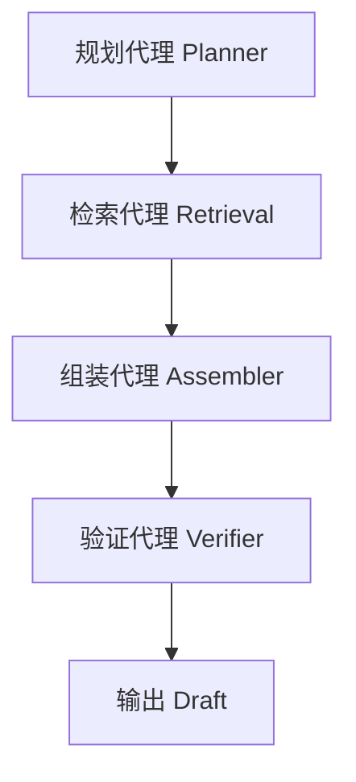

# ManuScript v2.0 战略分析报告
## Deep Research vs Material Assembly：架构选型深度研究

---

## 执行摘要

### 核心结论

ManuScript v2.0 应确立**以 Material Assembly 为核心**的差异化战略，将产品定位从单纯的"写作助手"升级为"认知脚手架"。

### 关键发现

1. **用户痛点错配**：Deep Research 解决的是"信息获取广度"，而学术写作的核心痛点是"引用准确性"与"素材组织"
2. **市场空白**：当前缺乏能将用户自有文献库智能组装成带精准引用初稿的工具
3. **技术路径**：基于 GraphRAG 的 Material Assembly 在可信度、成本、响应速度上全面优于通用 Deep Research

### 战略建议

- **Phase 1**：聚焦 Material Assembly 核心能力
- **Phase 2**：以插件形式审慎引入受控的 Deep Research（用于"缺口分析"）
- **Phase 3**：构建垂直工作流生态

---

## 第一部分：目标用户痛点机制分析

### 1.1 学术写作的双重焦虑

#### "空白画布综合症"（初期痛点）

**表现**：面对空白文档的心理压力导致严重拖延

**现有解决方案**：ChatGPT、Jasper 等通过自动补全缓解问题

**局限性**：生成流畅但缺乏证据支撑

#### "引用噩梦"（核心痛点）

**本质**：学术界文本的证据价值远高于生成价值

**关键数据**：
- GPT-4 等模型生成的引用中高达 **70% 可能是虚构的**
- 用户必须花费大量时间进行"法医式"核查
- AI 工具反而增加了工作总量

**对 ManuScript 的启示**：
> 用户需要的不是能"凭空写作"的 AI，而是能"基于证据写作"的智能助理

### 1.2 认知负荷与语境切换成本

#### 碎片化工作流的代价

**典型场景**：
```
Zotero（文献管理）→ PDF 阅读器 → SciSpace（理解）→ ChatGPT（起草）→ Word（撰写）
```

**认知损耗**：
- 从一次干扰中恢复专注平均需要 **23 分钟**
- 每次跨工具数据搬运都意味着思维流断裂

**设计原则**：
> AI 工具应作为"认知卸载"媒介，而非新的认知负担

### 1.3 信任赤字与控制权需求

#### "人在回路"（HITL）的重要性

**核心诉求**：
- 用户希望 AI "像研究助理提供带页码引用的证据"，而非"像代笔者给出成品"
- 学术写作极其强调作者主体性与责任感

**架构影响**：
- **Deep Research**：黑盒式自主性，剥夺用户判断权
- **Material Assembly**：透明度 + 可干预性，契合心理需求

---

## 第二部分：竞品生态与市场格局

### 2.1 核心竞品能力矩阵

| 维度 | Jenni AI | SciSpace | Paperpal | OpenAI Deep Research |
|---|---|---|---|---|
| **核心价值** | 消除写作阻塞 | 理解复杂文献 | 投稿级润色 | 自主信息综合 |
| **技术架构** | 轻量 RAG + LLM 续写 | 语义搜索 + 向量库 | 学术语料微调模型 | O3/O4 推理 + 浏览器代理 |
| **研究深度** | 低（表面引用） | 高（2.8 亿论文库） | 无（仅语言形式） | 极高（多轮迭代） |
| **用户控制** | 高（逐句确认） | 中（问答交互） | 高（修订模式） | 低（黑盒处理） |
| **长文能力** | 弱（缺乏全局意识） | 弱（单点知识） | 无 | 强（结构化报告） |
| **引用可靠** | 中（有虚构风险） | 高（链接原文） | N/A | 波动（信源质量） |

### 2.2 市场空白："综合层"的缺失

#### 现有产品的结构性短板

**Jenni AI**：
- ✅ UX 流畅度优秀
- ❌ 缺乏宏观结构把控
- ❌ 长文易"跑题"或重复

**SciSpace**：
- ✅ 文献检索和阅读辅助卓越
- ❌ 止步于"理解"，未打通"写作"
- ❌ 用户仍需手动复制粘贴到 Word

**Deep Research**：
- ✅ 信息检索广度强大
- ❌ 通用性陷阱：不适配学术垂直需求（特定引用格式、期刊筛选、方法论细节）
- ❌ 高成本 + 长延迟（不适合实时写作辅助）

#### ManuScript v2.0 的战略机会

**定位**："综合层"（Synthesis Layer）工具

**核心能力**：
```
用户导入 50 篇 PDF
     ↓
设定写作大纲
     ↓
智能提取观点/数据/反例
     ↓
组装成有理有据的初稿
```

---

## 第三部分：Deep Research vs Material Assembly 战略对比

### 3.1 概念定义与运作机制

#### Deep Research（深度研究）

**机制**：
- 基于"代理"（Agent）的自主模式
- 用户输入宽泛主题 → AI 自主分解任务 → 多轮网络检索 → 综合报告

**适用场景**：探索性研究、信息盲区探索

**核心局限**：
- ❌ 高计算成本 + 长延迟（数分钟到数十分钟）
- ❌ 低质量网络信源风险
- ❌ 幻觉风险随搜索广度指数级上升
- ❌ 用户失去对研究路径的控制

#### Material Assembly（素材组装）

**机制**：
- 基于 RAG 的封闭域模式
- 用户预先上传文献 → 提供大纲 → AI 仅使用已有素材 → 填充内容

**核心优势**：
- ✅ 极高可信度与引用准确性（用户审核过的素材）
- ✅ 极低幻觉率（Grounding）
- ✅ 符合学术写作严谨流程
- ✅ 快速响应（秒级），支持实时交互

**局限性**：
- ⚠️ 依赖用户已有知识库
- ⚠️ 无法自动获取新信息

### 3.2 深度对比分析：为什么 Material Assembly 优先

#### 3.2.1 学术严谨性与溯源（Provenance）

| 维度 | Deep Research | Material Assembly |
|---|---|---|
| **信源质量** | 开放网络，参差不齐 | 同行评审的文献库 |
| **引用可追溯性** | 困难（网页可能消失） | 强（链接到 PDF 具体段落） |
| **验证成本** | 高（需逐一核查网页） | 低（"点击即验证"） |

#### 3.2.2 结构化长文生成能力

**Deep Research 的问题**：
- 擅长总结性报告
- 缺乏对万字级论文的宏观叙事把控
- 易出现"迷失中间"（Lost in the Middle）现象

**Material Assembly 的优势**：
- 强制"大纲驱动"（Outline-Driven）
- AI 在生成每章节时都具备全局上下文意识
- 保持长文逻辑连贯性

#### 3.2.3 成本与性能经济学

| 项目 | Deep Research | Material Assembly |
|---|---|---|
| **推理成本** | 极高（数百万 Token 迭代） | 可控（本地/云端向量检索） |
| **响应速度** | 分钟级 | 秒级 |
| **商业模式** | 高价订阅（$200/月） | 适合高频日常使用 |

---

## 第四部分：技术架构设计

### 4.1 传统 RAG 的局限性

#### "碎片化"陷阱

**问题场景**：
```
用户问题："比较这十篇论文中关于深度学习优化算法的演变"
传统 RAG：将文档切成 512 token 片段 → 检索到零散片段 → 丢失整体逻辑
```

**后果**：
- 生成文本支离破碎，缺乏深度
- 跨部分信息（方法在第二章、结果在第四章）难以关联

### 4.2 核心架构升级：GraphRAG

#### 4.2.1 分层索引（Hierarchical Indexing）

```
Document (论文)
  ↓
Section (章节)
  ↓
Paragraph (段落)
  ↓
Chunk (文本块)
```

**检索策略**：
1. 先定位相关"章节"
2. 再深入到"段落"
3. 保留上下文语境

#### 4.2.2 知识图谱提取

**预处理阶段**：
- 提取实体：作者、方法、理论、数据集
- 构建关系：引用、反驳、改进

**查询优势**：
```
问题："哪些论文反驳了 Smith 的理论？"
图谱检索：即使原文无关键词，关系边也能找到答案
```

#### 4.2.3 全局摘要生成

**Map-Reduce 聚类**：
- 对文档群进行高层级观点综述
- 特别适合"文献综述"（Literature Review）章节

### 4.3 代理工作流：Chain-of-Agents

#### 四层代理架构



**各代理职责**：

1. **规划代理（Planner）**
   - 分析大纲与写作意图
   - 拆解为子任务（如"查找支持论点 A 的数据"）

2. **检索代理（Retrieval）**
   - 在 GraphRAG 索引中生成精确查询
   - 支持图谱遍历

3. **阅读/组装代理（Assembler）**
   - 阅读检索内容
   - 剔除不相关信息
   - 按风格要求综合写作

4. **批评/验证代理（Verifier）**
   - 基于 Hallucination Aware Tuning (HAT)
   - 反向检查每句话是否有原文支撑
   - 发现幻觉则拒绝输出

### 4.4 混合数据隐私模型

**架构设计**：

| 功能模块 | 部署方式 | 数据处理 |
|---|---|---|
| **Deep Research** | 云端沙箱 | 公开网络数据 |
| **Material Assembly** | 本地/私有云 | 用户核心知识资产 |

**合规优势**：
- 满足 ZDR（零数据留存）要求
- 确保未发表论文不被用于训练通用模型

---

## 第五部分：用户体验（UX）设计

### 5.1 "编辑器即界面"（Canvas Model）

#### 三栏式布局

```
┌─────────────────┬──────────────────┬─────────────────┐
│   左侧资源库    │    中间编辑器    │  右侧智能辅助   │
│                 │                  │                 │
│ • PDF 列表      │ • 块级编辑       │ • 思考过程      │
│ • 知识图谱视图  │ • 大纲驱动       │ • 源卡片展示    │
│ • 摘录笔记      │ • 实时协作       │ • 操作建议      │
└─────────────────┴──────────────────┴─────────────────┘
```

#### 主动组装交互（Active Assembly）

**操作流程**：
1. 用户在编辑器中高亮大纲标题
2. 点击"组装素材"按钮
3. AI 在右侧展示相关引文卡片
4. 用户批准/拒绝后，AI 插入综合段落

**设计优势**：
- 增强用户掌控感
- 避免黑盒式生成

### 5.2 认知人体工程学设计

#### 源头高亮与溯源连线

**交互逻辑**：
```
用户点击编辑器中的 AI 文本
     ↓
左侧 PDF 查看器自动高亮对应段落
     ↓
可视化连线连接二者
```

**价值**：消除手动查找页码的痛苦

#### 状态透明化

**反面案例**：
```
❌ "正在思考..."
```

**改进方案**：
```
✅ "正在分析 Smith(2023) 的方法部分..."
✅ "正在对比三篇论文的数据..."
✅ "已找到 5 个相关证据片段"
```

**目的**：建立用户信任，减少焦虑

---

## 第六部分：战略实施路线图

### Phase 1：打造"智能泥瓦匠"（Q1-Q2）

#### 核心功能
- 上线基于 GraphRAG 的本地文档组装引擎

#### 目标
- 用户上传 20-50 篇 PDF
- 通过大纲驱动一键生成带精准引用的初稿

#### 关键指标（KPI）
- **引用准确率**：≥ 99%
- **生成速度**：1000 字章节 ≤ 30 秒

#### 技术重点
- 实现分层索引
- PDF 深度解析（公式、图表）

### Phase 2：引入"缺口侦探"（Q3）

#### 战略定位
Deep Research 作为 Material Assembly 的**补充**，而非替代

#### 功能场景：Gap Analysis Research

```
Material Assembly 发现素材不足
     ↓
系统提示："现有文献缺乏关于 X 的数据"
     ↓
询问用户："是否启动 Deep Research 搜索补充证据？"
     ↓
按需触发（On-Demand）
```

#### 优势
- 控制 Token 成本
- 保持用户主导权
- 解决本地资料库局限性

### Phase 3：构建垂直工作流生态（Q4+）

#### 生态整合

**文献管理对接**：
- Zotero API
- Mendeley API
- 自动同步文献库

**排版工具插件**：
- Overleaf 插件
- Word 插件
- 嵌入 Material Assembly 能力

#### 商业模式

| 功能层级 | 定价策略 |
|---|---|
| **Material Assembly** | 基础订阅（核心功能） |
| **Deep Research** | 增值服务 / 按次计费 |
| **高级算力包** | 企业级订阅 |

---

## 结论

### 核心洞察

ManuScript v2.0 的成功关键不在于拥有最强的模型（这是快速商品化的通用能力），而在于**拥有最懂学术工作流的上下文环境**。

### 战略原则

1. **主次分明**：
   - **主**：Material Assembly（核心引擎）
   - **次**：Deep Research（补充插件）

2. **用户痛点导向**：
   - 解决"引用噩梦"与"认知负荷"
   - 提供通用竞品无法企及的精确性与可控性

3. **垂直壁垒**：
   - 深耕学术写作垂直领域
   - 构建基于 GraphRAG 的技术护城河

### 最终愿景

将 ManuScript v2.0 打造成科研人员不可或缺的**"认知外骨骼"**，在日益拥挤的 AI 写作市场中建立坚实的差异化优势。

---

## 附录

### 术语表

- **RAG**：Retrieval-Augmented Generation，检索增强生成
- **GraphRAG**：基于知识图谱的 RAG 架构
- **HITL**：Human-in-the-Loop，人在回路
- **HAT**：Hallucination Aware Tuning，幻觉感知调优
- **ZDR**：Zero Data Retention，零数据留存

### 参考文献编号说明

本报告中的上标数字（如 1、2、5）为原文档中的引用编号，保留用于溯源。具体文献列表可在原始分析资料中查阅。