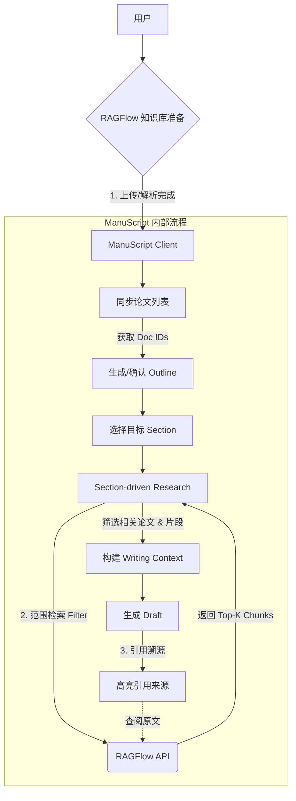

# ManuScript Reboot Pack

> 本文档用于指导：**从旧项目安全继承可复用资产，同时严格避免功能与架构复发**。

---

## Part 0. 继承策略总原则（请先读）

**唯一继承标准：**
> 是否直接服务于「Section 级论文写作」？

- 如果 **只是让系统更聪明** → ❌ 不继承
- 如果 **直接让某一节更容易写出来** → ✅ 继承

---

## Part 1. 旧项目继承清单（RAGFlow 托管模式）

### 架构变更核心

> **本地不再进行任何 PDF 解析、切分或存储。所有非结构化数据处理下沉至 RAGFlow，ManuScript 只通过 API 消费结构化数据（Chunks/Images）。**

### 1.1 ✅ 核心继承与替换策略（RAGFlow 托管模式）

| 模块 / 资产 | 是否继承旧代码 | 新策略 (RAGFlow Adapter) | 详细说明 |
|---|---|---|---|
| PDF 解析与 OCR | ❌ 不继承 | 完全托管 (API) | 直接调用 RAGFlow 解析能力。不保留任何 PyMuPDF 或本地 OCR 代码。 |
| Chunk 切分与位置 | ❌ 不继承 | API 获取 | 不再维护切分算法。通过 API 获取 RAGFlow 解析好的 Chunks（含 Token 坐标、页码）。 |
| 本地论文库 (Storage) | ❌ 不继承 | ID 映射 (Sync) | 本地 DB 仅存储 RAGFlow_Document_ID 与 Title 的映射关系，不再存储全文文本。 |
| 句级证据追溯 | ⚠️ 逻辑重写 | 引用适配 | 核心价值保留，但实现方式改为：解析 RAGFlow 返回的 provenance 数据，回显对应的原文片段。 |
| 表格与图片提取 | ✅ 新增能力 | API 获取 | 利用 RAGFlow 对 Table/Image 的解析优势，在写作时自动检索相关图表作为素材。 |

> ⚠️ 原则：**这些模块只能被 Section 使用，不能单独暴露给用户。**

---

### 1.2 ⚠️ 业务逻辑层（需基于 API 重构）

| 模块 | 处理方式 | 变更重点 |
|---|---|---|
| Paper Filter (筛选) | 重构 | 基于 Metadata 过滤 - 利用 RAGFlow 的 retrieval 接口，在特定 Document ID 范围内进行检索，而不是本地遍历。 |
| Section Writer | 重构 | Context 组装 - 将 API 返回的 Chunks 组装成 Prompt Context，不再从本地 VectorDB 读取。 |

---

### 1.3 ❌ 明确不继承（必须删除）

| 模块 | 处理方式 | 原因 |
|---|---|---|
| Intent Router | 删除 | ManuScript 不支持自由意图 |
| 通用 Deep Research 入口 | 删除 | 写作导向不允许开放探索 |
| Supervisor Loop | 删除 | 写作任务有明确终点 |
| SubQuestion Decomposer | 删除 | Outline 已提供子问题 |
| Report Generator | 删除 | 目标不是报告 |
| CLI 模式 | 删除 | 写作产品不需要 |

> **这张表就是“新文件夹的第一道防线”。**

---

## Part 2. Boundary Manifesto（功能边界声明）

> 文件建议名：`BOUNDARY.md`

```markdown
# ManuScript Boundary Manifesto

ManuScript exists to help users:
- Write academic papers section by section.

ManuScript WILL:
- Help structure literature into outlines
- Help select relevant papers for a specific section
- Generate draft paragraphs with explicit evidence

ManuScript WILL NOT:
- Perform open-ended research
- Decide research directions autonomously
- Generate full papers in one click
- Act as a general-purpose AI assistant

If a feature does not directly help:
"finish writing a specific section",
it must not be implemented.
```

---

## Part 3. 核心用户旅程（RAGFlow Workflow）

> 流程定义：**"以 RAGFlow 为底座的 Section 级写作流"**



### 详细步骤说明

**1. 准备阶段 (Prerequisite)**
- 用户在 RAGFlow 端建立 Knowledge Base (KB)
- 用户上传 PDF，RAGFlow 完成解析（Parsing）和切分（Chunking）
- ManuScript 动作：输入 RAGFlow 的 `API_KEY` 和 `DATASET_ID`，拉取当前库中的论文列表（Title + Doc_ID）

**2. 大纲阶段 (Outline)**
- 用户输入题目，LLM 生成 Outline
- 用户选中目标 Section（如 `3.1 Method Overview`）

**3. 筛选阶段 (Section Filtering)**
- ManuScript 生成该节的查询关键词
- 调用 API：向 RAGFlow 发送检索请求（限制在当前 Dataset）
- 数据获取：获得相关的 Chunks 列表，包含：
  - `content_with_weight` (文本)
  - `img_id` / `table` (图表数据)
  - `doc_name` (来源论文)
- 逻辑筛选：LLM 快速判断哪些 Chunks 真正与本节写作目标相关

**4. 写作阶段 (Drafting)**
- 将筛选后的 Chunks + 图片描述填入 Prompt
- 生成包含引用的段落
- 引用格式化：`[doc_name, page_num]` (数据来自 RAGFlow 元数据)

**注意：**
- 系统一次只服务一个 Section
- 不存在"自由对话入口"

---

## Part 4. V1 关键数据结构变更 (Data Model)

为了适配 RAGFlow 托管模式，核心数据模型应精简为：

```python
# 以前：存储了海量文本和向量
# 现在：只存储指针

class PaperReference:
    id: str                # Local UUID
    ragflow_doc_id: str    # 远程 ID
    title: str
    authors: str
    status: str            # 'parsed' in RAGFlow

class SectionContext:
    section_id: str
    intent: str
    # 不需要存 Embedding，只需要存这一节用到了哪些 RAGFlow 的 Chunk ID
    used_chunk_ids: List[str]
```

> **关键优势：** 你完全避开了最难的"多栏 PDF 解析"和"表格还原"问题，直接站在了 RAGFlow 的肩膀上。

---

## Part 5. V1 执行 Backlog（≤15 项）

> 文件建议名：`docs/v1_backlog.md`

### P0（必须完成）

1. 项目新仓库初始化（ManuScript）
2. RAGFlow API 适配层开发
3. 建立最小 Paper 数据模型（ID 映射）
4. 论文列表同步（从 RAGFlow 拉取）
5. Outline 生成（单 Prompt）
6. Outline 编辑 / 选择 Section
7. Section Research Brief 生成
8. Section-aware 论文检索（调用 RAGFlow API）
9. Chunk 筛选与排序
10. 证据片段展示（带来源）
11. Section Draft Writer（单节）
12. 引用标注（doc_name + page_num）

### P1（可延后）

13. Section 完成状态管理
14. Draft 再生成 / 微调
15. 简单导出（Markdown）

---

## Part 6. 使用说明（给未来的你）

- **任何新功能 → 先对照 Part 1**
- **任何设计分歧 → 回到 Boundary**
- **感觉复杂 → 检查是否违反“Section 级”原则**

---

> 结论：
> ManuScript 不是旧项目的升级版，
> 而是一个**以旧项目为零件仓的全新系统**。

